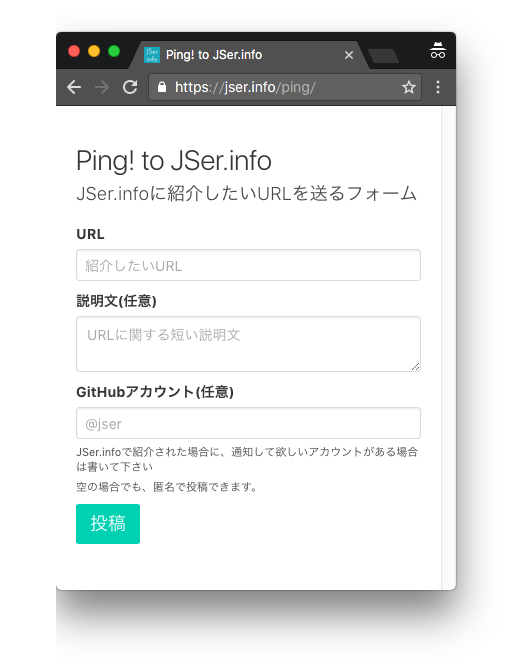

# Ping

このリポジトリは[JSer.info](https://jser.info/ "JSer.info")に対してのオープンInboxです。

自分が作ったプロジェクトやニュース、フィードバックなど[何でもIssueとして立てる](https://github.com/jser/ping/issues/new)ことができます。

## 目的

[JSer.info Pull Request Form](https://jser.info/contributing/ "JSer.info Pull Request Form")を使って、直接[Pull Requestガイド](https://github.com/jser/jser.info/blob/gh-pages/CONTRIBUTING.md "Pull Requestガイド")をする方法も用意していますが、
フォーマットが難しかったり気軽に送りつける事が難しい感じでした。

このリポジトリは、もっと気軽に作ったものとかのURLを投げやすくすることを目的にしています。
そのため、匿名でIssueを立てる方法もあるので、作ったものをどんどん投げていくといいと思います。

- [https://jser.info/ping/](https://jser.info/ping/)

[](https://jser.info/ping/)

手動でIssueを作りたい場合は、[Create New Issue](https://github.com/jser/ping/issues/new?body=---%0D%0Atitle%3A+JSer.info%0D%0Aurl%3A+https%3A%2F%2Fjser.info%2F%0D%0A%0D%0A---%0D%0A%0D%0A%5B%E7%9F%AD%E3%81%84%E8%AA%AC%E6%98%8E%5D)から次のフォーマットを埋めると良さそうです。

```yaml
---
title: JSer.info
url: https://jser.info/

---

[短い説明]
```

既存の[Issue](https://github.com/jser/ping/issues)で興味深いものがあるなら :+1: などのリアクションボタンで投票すると参考になります。

## Gitter

手早くPingを送る方法として[jser/jser.info - Gitter](https://gitter.im/jser/jser.info?source=orgpage "jser/jser.info - Gitter")もあります。

[](https://gitter.im/jser/jser.info)


## 元ネタ

- [thechangelog/ping: Ping! Share projects, news, or feedback. Just create an issue.](https://github.com/thechangelog/ping "thechangelog/ping: Ping! Share projects, news, or feedback. Just create an issue.")